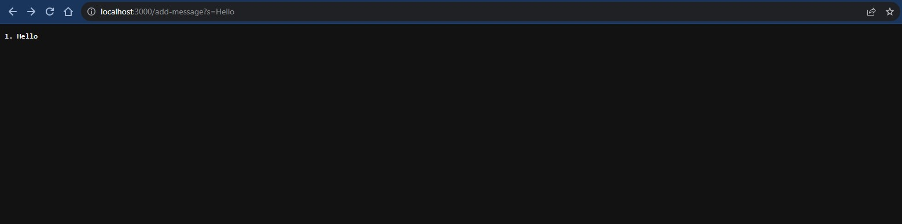
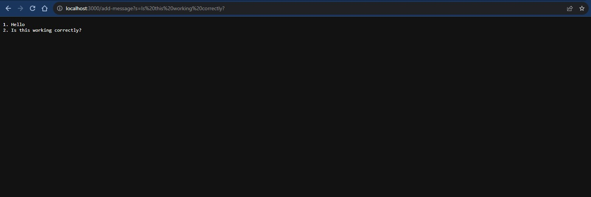
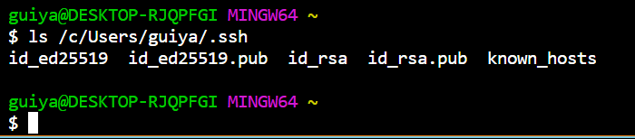
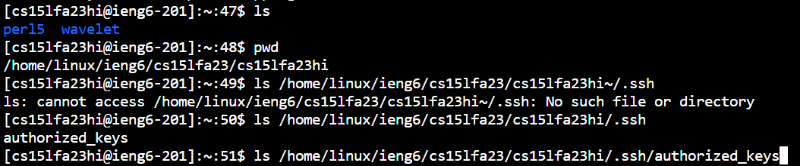
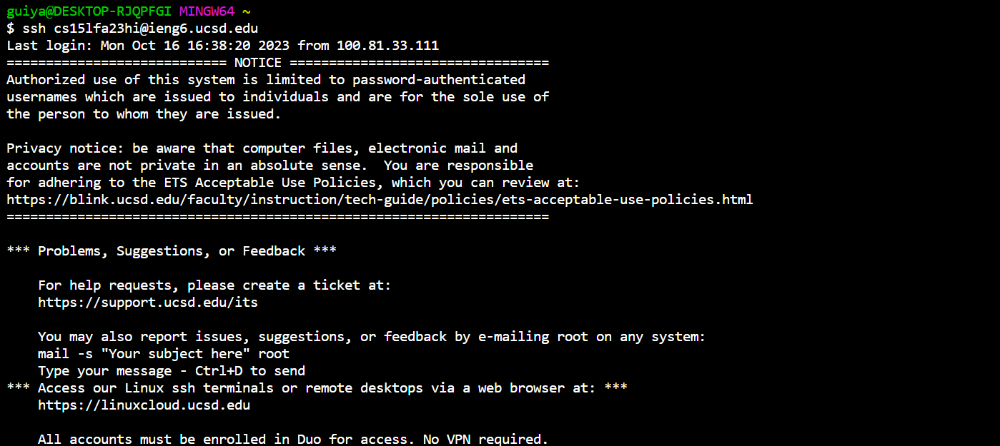

# **CSE 15L Lab Report 2** 

# **Part 1** <br>

Code adapted from: [https://github.com/ucsd-cse15l-f23/wavelet/blob/main/NumberServer.java](https://github.com/ucsd-cse15l-f23/wavelet/blob/main/NumberServer.java) <br>


```
import java.io.IOException;
import java.net.URI;

class Handler implements URLHandler {
    String serverString = "";
    int stringNum = 0;

    public String handleRequest(URI url) {
        if (url.getPath().equals("/")) {
            return serverString;
        } else {
            if (url.getPath().contains("/add-message")) {
                String[] parameters = url.getQuery().split("=");
                if (parameters[0].equals("s")) {
                    String addingString;

                    if(stringNum!=0){
                        stringNum++;
                        addingString = "\n" + stringNum + ". " + parameters[1];
                    }else{
                        stringNum++;
                        addingString = stringNum + ". " + parameters[1];
                        
                    }
            
                    serverString = serverString + addingString;
                    return serverString;
                }
            }
            return "404 Not Found!";
        }
    }
}

class StringServer {
    public static void main(String[] args) throws IOException {
        if(args.length == 0){
            System.out.println("Missing port number! Try any number between 1024 to 49151");
            return;
        }

        int port = Integer.parseInt(args[0]);

        Server.start(port, new Handler());
    }
}
```
<br>

 <br>
- When using /add-message?s=Hello, the main method and the ```handleRequest``` method is called. <br>
- The relevant argument for the ```main {}``` method is String[] args which gets the port number for the server. The relevant field in the ```StringServer``` class is port which is an int that holds the port number extracted from args. <br>
- The relevant argument for ```handleRequest``` is the URL and in this case, it is http://localhost:3000/add-message?s=Hello. The relevant fields in the ```Handler``` class are serverString, a string that holds the string output for the server, stringNum, an int that keeps count of the number of strings added for listing, and addingString, a string that holds the processed string that needs to be added to update serverString. There is also a string array named parameters which holds the initial string from the URL that needs to be added and the query string.<br>
After this request, the only permanent changes after initialization and declaration of the variables is serverString changing to "1. Hello" from "" and stringNum changing to 1 from 0. There are temporary changes to addingString and parameters until the next add-message request. In this case addingString changes by declaring to "1. Hello", and parameters changes by being declared to ["s", "Hello"]. There are no changes to port because we didn't change servers and stayed on the 3000 server node, meaning port's number is still 3000.   <br> <br>

 <br>
- When using /add-message?s=Hello, the ```main {}``` method and the ```handleRequest``` method is called. <br>
- The relevant argument for the `main {}` method is String[] args which gets the port number for the server. The relevant field in the ```StringServer``` class is port which is an int that holds the port number extracted from args. <br>
- The relevant argument for ```handleRequest``` is the URL and in this case, it is http://localhost:3000/add-message?s=Is this working correctly, it also auto resolved to http://localhost:3000/add-message?s=Is%20this%20working%20correctly? in the URL. The relevant fields in the ```Handler``` class are serverString, a string that holds the string output for the server, stringNum, an int that keeps count of the number of strings added for listing, and addingString, a string that holds the processed string that needs to be added to update serverString. There is also a string array named parameters which holds the initial string from the URL that needs to be added and the query string.<br>
- After this request, the permanent changes are serverString changing to "1. Hello 2. Is this working correctly?" (imagine 1. and 2. on separate lines) from "1. Hello" and stringNum changing to 2 from 1. There are temporary changes to addingString and parameters until the next add-message request. In this case, addingString changes by declaring to \n + "2. Is this working correctly?", and parameters changes by being declared to ["s", "Is this working correctly?"]. There are no changes to port because we didn't change servers and stayed on the 3000 server node, meaning port's number is still 3000.   <br>
<br>
 


# **Part 2**<br>
 <br>
- Path is /c/Users/guiya/.ssh/id_rsa <br>

 <br>
- Path is /home/linux/ieng6/cs15lfa23/cs15lfa23hi/.ssh/authorized_keys

 <br>

<br>

# **Part 3** <br>
- Before weeks 2 and 3, I didn't know what were local servers and how to set them up with the code I was writing in VSCode. After weeks 2 and 3, I now know about the localhost with the server node numbers, how to compile and set up a server with Server.java, how to code classes and functions that can be used to set up functionality for a server and update the server and its local website using the URL as a method to receive requests.
