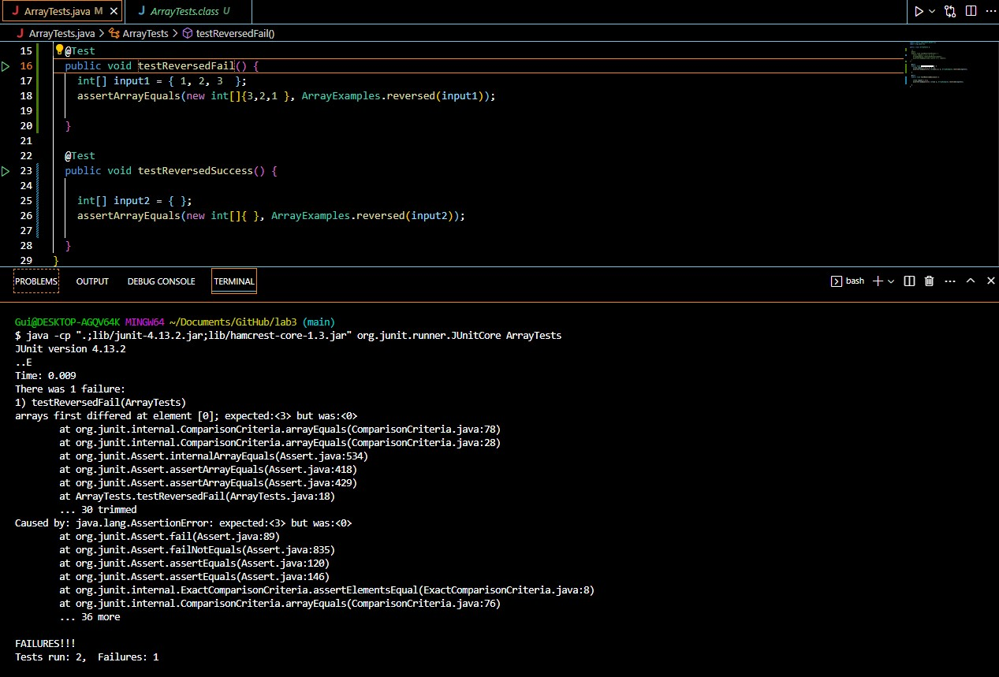

# **CSE 15L Lab Report 2** 

# **Part 1 - Bugs** <br>
I will be writing about the bug in the ```reversed``` method within ```ArrayExamples``` <br>


```
// Returns a *new* array with all the elements of the input array in reversed
  // order
  static int[] reversed(int[] arr) {
    int[] newArray = new int[arr.length];
    for(int i = 0; i < arr.length; i += 1) {
      arr[i] = newArray[arr.length - i - 1];
    }
    return arr;
  }

```

```
import static org.junit.Assert.*;
import org.junit.*;

public class ArrayTests {

  /* 
	@Test 
	public void testReverseInPlace() {
    int[] input1 = { 1, 2, 3 };
    ArrayExamples.reverseInPlace(input1);
    assertArrayEquals(new int[]{ 3 }, input1);
	}
*/

  @Test
  public void testReversedFail() {
    int[] input1 = { 1, 2, 3  };
    assertArrayEquals(new int[]{3,2,1 }, ArrayExamples.reversed(input1));
    
  }

  @Test
  public void testReversedSuccess() {
    
    int[] input2 = { };
    assertArrayEquals(new int[]{ }, ArrayExamples.reversed(input2));
    
  }
}

```
<br>
My failure-inducing JUnit test input was the array {1,2,3} which expected {3,2,1}, but did not get the expected value from the test. <br>
My non-failure-inducing JUnit test input was {}, which expected {}, and the test passed the test matched the expected. <br>

 <br>
These are the symptoms for the two tests, ```testReversedFail``` with the {1,2,3} input failed and ```testReversedSuccess``` did not fail with an input of {}.


# **Part 2 - Researching Commands** <br>
