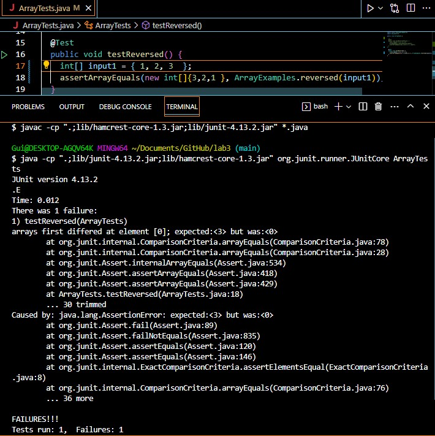

# **CSE 15L Lab Report 2** 

# **Part 1 - Bugs** <br>


# **Part 2 - Researching Commands** <br>
<br>
I will be writing about the bug in the ```reversed``` method within ```ArrayExamples```. <br>


```
import static org.junit.Assert.*;
import org.junit.*;

public class ArrayTests {

  /* 
	@Test 
	public void testReverseInPlace() {
    int[] input1 = { 1, 2, 3 };
    ArrayExamples.reverseInPlace(input1);
    assertArrayEquals(new int[]{ 3 }, input1);
	}
*/

  @Test
  public void testReversed() {
    int[] input1 = { 1, 2, 3  };
    assertArrayEquals(new int[]{3,2,1 }, ArrayExamples.reversed(input1));
  }
}
```
<br>
My failure-inducing input was the array {1,2,3} into the JUnit test which expected {3,2,1}, but did not get the expected value from the test.
