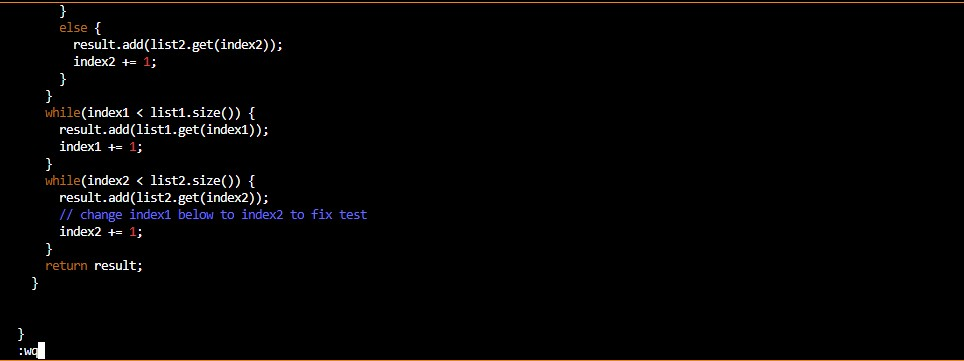

# **CSE 15L Lab Report 4** 

<br>
<br>
<br>

Step 4. ```<ssh cs15lfa23hi@ieng6.ucsd.edu>``` + ```<enter>``` <br>
<br>
    I typed the ssh command with my login and pressed enter to get into ieng6.


<br>
<br>
<br>


Step 5. ```<git clone>``` + ```<ctrl + v>``` + ```<enter>``` <br>
<br>
    I had already pre-copied the ssh url of my lab7 repository, so I just needed to type ```<git clone>``` then paste the ssh url in with ```<ctrl + v>```.


<br>
<br>
<br>


Step 6. ```<cd lab7>``` + ```<enter>``` + ```<bash test.sh>``` + ```<enter>``` <br>
<br>
    I cd into lab7 and then ran the tests by running the test.sh script that contains the commands to compile and run the tester.


<br>
<br>
<br>


Step 7. ```<vim ListExamples.java>``` + ```<enter>``` + hold ```<down>``` + hold ```<right> ```+ ```<i>``` + ```<backspace>``` + "2" + ```<escape>``` + ":wq" + ```<enter>``` <br>
<br>
    Here I vim into ListExamples, then held ```<down>``` to get the buggy line of code, and then held <right> to get to the exact part that was buggy in that line.
    I then pressed ```<i>``` to start inserting. I pressed ```<backspace>``` and 2 to replace the 1 to a 2, making index1 go to index2.
    I pressed ```<escape>``` to go back to normal mode and typed ":wq" to save and exit.



<br>
<br>
<br>


Step 8. ```<up>``` + ```<up>``` + ```<enter>``` <br>
<br>
    The "bash test.sh" command was 2 up in the history so I pressed up twice and press ```<enter>``` to run the tests again.


<br>
<br>
<br>


Step 9. ```<git add ListExamples.java>``` + ```<enter>``` + ```<git commit>``` + ```<i>``` + ```<bug fix>``` + ```<escape>``` + ```<:wq>``` + ```<git push>``` + ```<enter>``` <br>
<br>
    I ```<git add ListExamples.java>``` to add it to the files that will be updated.
    Then put in ```<git commit>``` and press ```<i>``` to edit it with ```<bug fix>```, and then press ```<escape>``` to get to normal mode and type ```<:wq>``` to save and quit.
    Then I typed ```<git push>``` and pressed ```<enter>``` to push my update of ListExamples.java.


