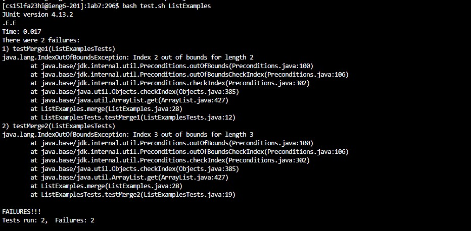
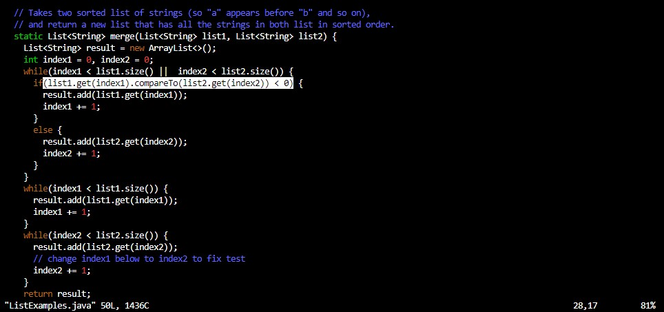

# **CSE 15L Lab Report 5** 

<br>
<br>
<br>


## **Part 1** 

1. <br>
 <br>
When I ran ```<bash test.sh ListExamples>``` it gave me two index out-of-bounds errors for the two tests. At first, I was thinking it was an array that was causing the index out of bounds, but there isn't any fixed sized arrays in ListExamples.java.

<br>

2. <br>
TA: More than just fixed-sized arrays can go out of bounds. Try looking at what code lines the test is giving you in ```ListExamples.java``` (line 28). What is on that line and around that line? Are there any list or array objects present? How and why would the index go out of bounds?
   
<br>

3. <br>
 <br>
At line 28, there is an if conditional that tries to compare two elements in two list objects, ```list1``` and ```list2```, and uses the index1 and index2 variables to try to access them. The ```index1``` and ```index2``` variables are being incremented, and it could be going out of bounds because ```index1``` or ```index2``` is getting too large. The if and while conditionals that control the incrementation of ```index1``` and ```index2``` seems to be correct. However, the outside while conditional seems to be wrong. It is ```while(index1 < list1.size() ||  index2 < list2.size()) ```, meaning that even if one of ```index1``` or ```index2``` is larger than the size of ```list1``` or ```list2```, respectively, as long as the other index is smaller than their respective list, it will keep running and it will over increment an index, making larger than its respective list's size and creating an index out of bounds error when they compare at the if conditional at line 28. I fixed the bug by replacing the ```||```, or statement, with a ```&&```, and statement, to make it like this ```while(index1 < list1.size() &&  index2 < list2.size()) ```. The code now works because both indexes must be smaller than their respective list's size for the while loop to run, so there won't be any index out of bounds errors when comparing at line 28 anymore.

<br>

4. <br>
The majority of the file structure and contents of each file are from here: (https://github.com/ucsd-cse15l-s23/lab7)[https://github.com/ucsd-cse15l-s23/lab7] <br>

<br>

In one folder called lab7, there should be: <br>
Two java files named ```ListExamples.java```, and ```ListExamplesTests.java```, <br>
One folder named lib containing the hamcrest and junit jar files needed to run the tests. <br>
One .sh script file named ```test.sh``` containing the commands to compile and run the junit tests for ```ListExamplesTests``` test class within ```ListExamplesTests.java```. <br>
<br>
In ```ListExamples.java```, it should initially look like this: <br>
```
// Returns a new list that has all the elements of the input list for which
  // the StringChecker returns true, and not the elements that return false, in
  // the same order they appeared in the input list;
  static List<String> filter(List<String> list, StringChecker sc) {
    List<String> result = new ArrayList<>();
    for(String s: list) {
      if(sc.checkString(s)) {
        result.add(0, s);
      }
    }
    return result;
  }


  // Takes two sorted list of strings (so "a" appears before "b" and so on),
  // and return a new list that has all the strings in both list in sorted order.
  static List<String> merge(List<String> list1, List<String> list2) {
    List<String> result = new ArrayList<>();
    int index1 = 0, index2 = 0;
    while(index1 < list1.size() ||  index2 < list2.size()) {
      if(list1.get(index1).compareTo(list2.get(index2)) < 0) {
        result.add(list1.get(index1));
        index1 += 1;
      }
      else {
        result.add(list2.get(index2));
        index2 += 1;
      }
    }
    while(index1 < list1.size()) {
      result.add(list1.get(index1));
      index1 += 1;
    }
```

<br>

In ```ListExamplesTests.java```, the contents should be this:
```
mport static org.junit.Assert.*;
import org.junit.*;
import java.util.*;
import java.util.ArrayList;


public class ListExamplesTests {
        @Test(timeout = 500)
        public void testMerge1() {
                List<String> l1 = new ArrayList<String>(Arrays.asList("x", "y"));
                List<String> l2 = new ArrayList<String>(Arrays.asList("a", "b"));
                assertArrayEquals(new String[]{ "a", "b", "x", "y"}, ListExamples.merge(l1, l2).toArray());
        }

        @Test(timeout = 500)
        public void testMerge2() {
                List<String> l1 = new ArrayList<String>(Arrays.asList("a", "b", "c"));
                List<String> l2 = new ArrayList<String>(Arrays.asList("c", "d", "e"));
                assertArrayEquals(new String[]{ "a", "b", "c", "c", "d", "e" }, ListExamples.merge(l1, l2).toArray());
        }

}
```
<br>

In test.sh, it should have these two commands: <br>
```
javac -cp .:lib/hamcrest-core-1.3.jar:lib/junit-4.13.2.jar *.java
java -cp .:lib/hamcrest-core-1.3.jar:lib/junit-4.13.2.jar org.junit.runner.JUnitCore ListExamplesTests
```

<br>

In the lib folder, it should have these two jar files: ```hamcrest-core-1.3.jar```and ```junit-4.13.2.jar```.

<br>

To fix the bug, on line 28 in ```ListExamples.java```, in the ```merge()``` function, you need to change the ```||``` to ```&&```, the or statement to an and statement, to change it from ```while(index1 < list1.size() ||  index2 < list2.size())``` to ```while(index1 < list1.size() &&  index2 < list2.size())```.

<br>


<br>
<br>

## **Part 2** 

<br>

Learning how to do everything from the command line was pretty cool. I didn't know that you could just go through your files, edit them with vim, and then save them with git add, git commit, and git push. I have always used an IDE like VScode, but knowing now that I can do everything with just the command line gives me a lot more options and flexibility. Also, I didn't know about jdb before as I used to only know about junit, but with jdb, it can give you a lot more flexibility in finding bugs when junit doesn't work as well by using commands within jdb like stopping at a certain line, and also being able to print the elements within the variables at those stopped lines.
