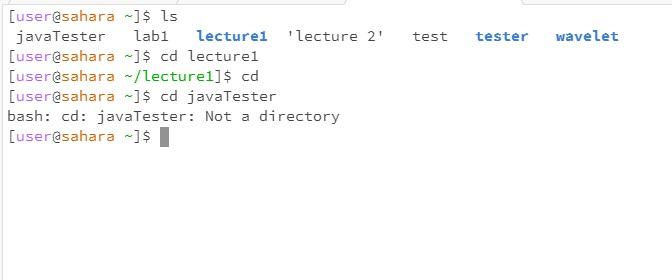
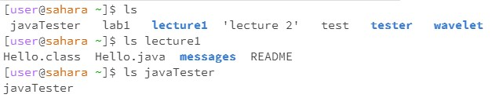
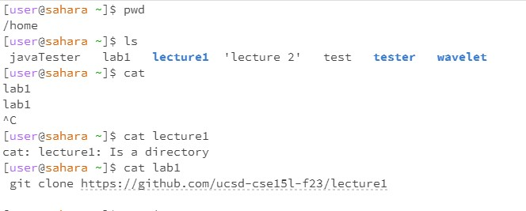

# **CSE 15L Lab Report 1** 

# **CD commands**
  
When using cd with no arguments, it sends the user back to the home directory. This is shown when I was in /home/lecture1, and when I used cd, the directory was back at /home. This output is not an error.  
When using cd with a folder as an argument, it sends the user into the directory and updates the working directory to that file. This is shown when I used cd lecture1 at /home, and my new directory was /home/lecture1. This output is not an error.  
When using cd with a file as an argument, it spits out an error. This is shown when I tried to cd into the javaTester file from /home, and it said that javaTester was not a directory. This output is an error and it's an error because cd changes your directory to the directory given, meaning that trying to cd into a file should and did produce an error because a file is not a directory.  

# **LS commands**
  
When using ls with no arguments, it shows the files and folders that your current working directory has. This is shown when I used ls at /home, and it showed all the files and folders in /home. This output is not an error.  
When using ls with a folder as an argument, it shows the files and folders that the specified folder has within it. This is shown when I used ls lecture1, and it showed me all the files in lecture1 and not at /home. This output is not an error.  
When using ls with a file as an argument, it repeats the name of the file. This is shown when I used ls javaTester, and it outputted "javaTester". This output is not an error.  

# **CAT commands**
  
When using cat with no arguments, it allows you to type things and it repeats them back until you terminate or quit out of it. This is shown when I was in the /home directory, used cat and then typed "lab1", it outputted "lab1", and I was quit using ctrl + c. This output is not an error.  
When using cat with a folder as an argument, it spits out an error saying that the folder is a directory. This is shown when I tried to type cat lecture1 in /home, and it just said that lecture1 was a directory. This output is an error because the cat command tries to print the contents of the file given, but but giving it a folder as an argument, it should and did print out an error because cat can print out the contents of a file, but not a directory.   
When using cat with a file as an argument, it outputs the contents of the file. This is shown when I tried to cat lab1 in my /home directory, and it outputted its git clone and github contents. This output is not an error.  
